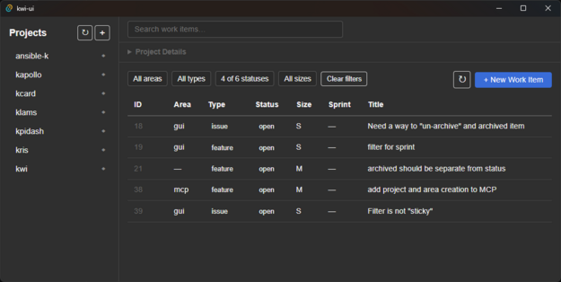

# kwi — Ken's Work Items

A small work item tracker: a Python CLI, an MCP server, and a Tauri + Svelte
desktop GUI over a PostgreSQL database.

> **Heads up:** This application is a very simple, single-user personal work
> item tracker. It is not generalized — it more or less expects my homelab
> environment. It should be straightforward to rework for your own setup by
> using an agent to make the needed changes. (I used Claude Opus 4.7/4.8 and
> Claude Sonnet 4.6 to build it.)

## Components

- **CLI** (`kwi`) — manage projects, areas, and work items from the terminal.
- **MCP server** (`kwi-mcp`) — expose work item tools to AI agents.
- **Desktop UI** (`kwi-ui`) — a Tauri + Svelte 5 GUI for browsing and editing
  work items.

## Documentation

- [Setup](docs/setup.md)
- [Usage](docs/usage.md)
- [Architecture](docs/architecture.md)
- [Specification](docs/specification.md)

## License

[MIT](LICENSE)
