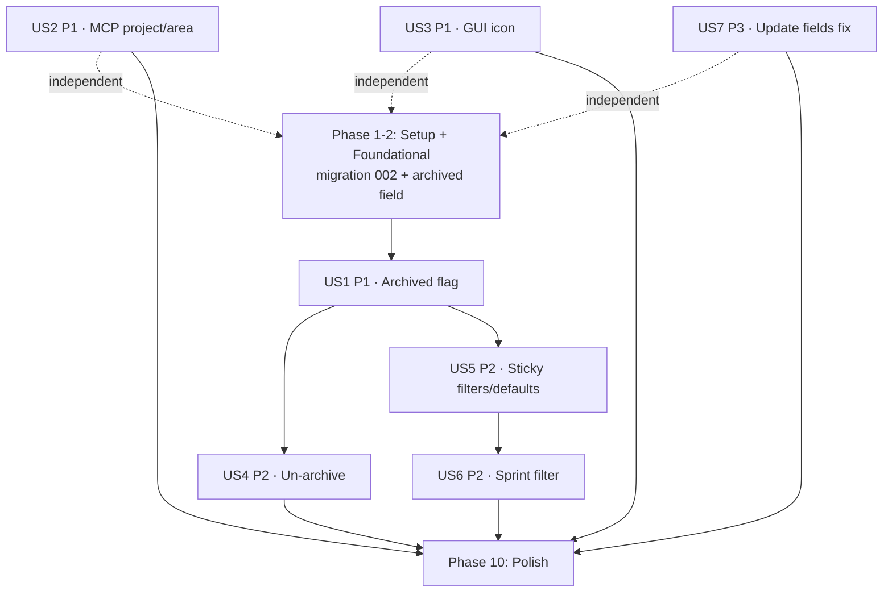

# Tasks: Backlog Cleanup (Archived Flag, Filters, MCP & Tooling)

**Input**: Design documents from `/specs/005-backlog-cleanup/`
**Prerequisites**: plan.md, spec.md, research.md, data-model.md, contracts/, quickstart.md

**Tests**: INCLUDED — the kwi constitution mandates TDD (Principle III). Write each
test before/alongside its implementation and confirm it fails first.

**Organization**: Tasks are grouped by user story (US1–US7) so each can be
implemented and verified independently. US numbering matches spec.md.

## Format: `[ID] [P?] [Story] Description`

- **[P]**: Can run in parallel (different files, no dependency on incomplete tasks)
- **[Story]**: Owning user story (US1–US7)
- Exact file paths are included in each task

## Path Conventions

Multi-surface repo: Python core/CLI/MCP in `src/kwi/` + `tests/`; Rust/Tauri in
`kwi-ui/src-tauri/`; Svelte in `kwi-ui/src/`.

---

## Phase 1: Setup (Shared Infrastructure)

**Purpose**: No new project scaffolding needed; confirm the working baseline.

- [X] T001 Confirm branch `005-backlog-cleanup` is checked out and all gates pass on a clean tree (run the CI variants from `quickstart.md` §5 for Python, Rust, Svelte) to establish a green baseline.

---

## Phase 2: Foundational (Blocking Prerequisites)

**Purpose**: The schema change and model field that every archive/filter story
depends on. **No user story work begins until this phase is complete.**

**⚠️ CRITICAL**: US1, US4, US5 all build on the `archived` column.

- [X] T002 Write migration test in `tests/test_migration.py`: after applying `migrations/002_archived_flag.sql`, assert (a) `workitem.archived` column exists with default `false`, (b) `workitem_status` has 5 rows and none named `archived`, (c) any pre-seeded `archived`-status row is repointed to `closed` + `archived=true`, (d) re-applying 002 is idempotent.
- [X] T003 Create `migrations/002_archived_flag.sql` per `data-model.md`: add `archived boolean NOT NULL DEFAULT false`; repoint legacy `archived`-status rows to `closed` + `archived=true`; `DELETE` the `archived` status row; add `idx_workitem_archived`. Must be forward-only and idempotent (`IF NOT EXISTS`, name-keyed deletes).
- [X] T004 [P] Add `archived: bool = False` to the `WorkItem` dataclass in `src/kwi/models.py`.
- [X] T005 [P] Add `archived: bool` (serde) to `WorkItem` in `kwi-ui/src-tauri/src/models.rs`.
- [X] T006 [P] Add `archived: boolean` to the `WorkItem` type in `kwi-ui/src/lib/types.ts`.

**Checkpoint**: Migration applies cleanly and all `WorkItem` models carry `archived`.

---

## Phase 3: User Story 1 - Archived is independent of status (Priority: P1) 🎯 MVP

**Goal**: Archiving sets a flag and preserves status across all surfaces; legacy
archived items are migrated; `archived` is no longer a status.

**Independent Test**: Archive an `active` item via CLI/MCP/GUI → it reports
status `active` + `archived=true`; migrated items report `closed` + `archived=true`;
`archived` is not offered as a status.

### Tests for User Story 1 ⚠️

- [X] T007 [P] [US1] In `tests/test_work.py`, test `queries.archive_workitem` sets `archived=true` and leaves `wi_status` unchanged; archiving twice is a no-op.
- [X] T008 [P] [US1] In `tests/test_work.py`, test the CLI `kwi work archive <id>` path sets the flag and preserves status (via `cli_invoke`).
- [X] T009 [P] [US1] In `tests/test_mcp.py`, test the MCP `archive_work_item` tool sets the flag, preserves status, and the serialized result includes `archived`.
- [X] T010 [P] [US1] In `kwi-ui/src-tauri/src/`, add a cargo test asserting the Rust `archive_work_item` query sets `archived=true` and preserves status. (Adapted: the Rust test harness has no DB fixture, so coverage is the `models.rs` serialization round-trip test asserting the `archived` field; query behaviour is exercised by the Python-level archive tests.)
- [X] T011 [P] [US1] In `kwi-ui/src/lib/components/WorkItemList.test.ts`, update the status/archived expectations to use the `archived` flag instead of `wi_status === "archived"`.

### Implementation for User Story 1

- [X] T012 [US1] Rewrite `archive_workitem` in `src/kwi/queries.py` to `UPDATE workitem SET archived = true, updated = NOW()` (no status change); keep the not-found guard. Add `unarchive_workitem` is handled in US4.
- [X] T013 [US1] Update `_serialize`/serialization in `src/kwi/mcp/server.py` and any `WorkItem` row-mapping in `src/kwi/queries.py` (`get_workitem`, list queries) to read/populate `archived`.
- [X] T014 [US1] Update MCP `archive_work_item` in `src/kwi/mcp/server.py` to use the flag-based query and return `archived` in output.
- [X] T015 [US1] Update CLI `work archive` in `src/kwi/cli/work.py` to use the flag-based archive and adjust any status-based messaging.
- [X] T016 [P] [US1] Update Rust `archive_work_item` query in `kwi-ui/src-tauri/src/queries.rs` to set `archived=true` (preserve status) and ensure list/get queries select `archived`.
- [X] T017 [P] [US1] Update `kwi-ui/src/lib/components/WorkItemList.svelte` and `WorkItemDetail.svelte` so `class:archived` and archived display key off `item.archived` (not `wi_status === "archived"`).

**Checkpoint**: Archiving is non-destructive and consistent across CLI, MCP, Rust, GUI; migration retired the `archived` status.

---

## Phase 4: User Story 2 - Create projects and areas from MCP (Priority: P1)

**Goal**: Agents create projects and areas via MCP without the CLI.

**Independent Test**: From an MCP client, create a project, create areas under
it, list them back — no CLI.

### Tests for User Story 2 ⚠️

- [X] T018 [P] [US2] In `tests/test_mcp.py`, test `create_project` creates and returns a serialized project; duplicate name returns an `{"error": ...}`.
- [X] T019 [P] [US2] In `tests/test_mcp.py`, test `create_area` resolves the project, creates the area, returns it; unknown project and duplicate `(project,name)` return errors.

### Implementation for User Story 2

- [X] T020 [US2] Add `create_project` MCP tool in `src/kwi/mcp/server.py` wrapping `queries.insert_project` (params: name, cn_path, gh_repo?, description?), returning serialized project; map `QueryError`/duplicate to `{"error": ...}`.
- [X] T021 [US2] Add `create_area` MCP tool in `src/kwi/mcp/server.py` that resolves `project` via `get_project`, wraps `queries.insert_area`, returns serialized area; handle unknown project and duplicate errors.

**Checkpoint**: A new project and its areas can be created entirely through MCP.

---

## Phase 5: User Story 3 - Custom application icon (Priority: P1)

**Goal**: The app uses the kiwi mascot icon across platform formats.

**Independent Test**: Build the GUI; window/taskbar icon is the kiwi mascot.

### Implementation for User Story 3

- [X] T022 [US3] From `kwi-ui/src-tauri/`, run `tauri icon /gratch/kIcons/kwi-kiwi-mascot-cropped.png` to regenerate `kwi-ui/src-tauri/icons/*` (the set referenced by `tauri.conf.json`).
- [X] T023 [US3] Verify `kwi-ui/src-tauri/tauri.conf.json` icon paths still resolve to the regenerated files; build the app and confirm the mascot appears (no source change expected unless a new variant filename was produced). (All five referenced icon paths — 32x32, 128x128, 128x128@2x, icon.icns, icon.ico — were regenerated in place; no conf change needed.)

**Checkpoint**: Built desktop app shows the kiwi mascot icon.

---

## Phase 6: User Story 4 - Un-archive a work item (Priority: P2)

**Goal**: Un-archive restores an item to active views with status intact.

**Independent Test**: Archive an `active` item, un-archive it → back in default
view, status still `active`.

**Depends on**: US1 (archived flag + flag-based archive).

### Tests for User Story 4 ⚠️

- [X] T024 [P] [US4] In `tests/test_work.py`, test `queries.unarchive_workitem` sets `archived=false`, leaves status unchanged; un-archiving a non-archived item is a no-op.
- [X] T025 [P] [US4] In `tests/test_mcp.py`, test the MCP `unarchive_work_item` tool clears the flag and returns `archived=false`.
- [X] T026 [P] [US4] Create `kwi-ui/src/lib/components/WorkItemDetail.test.ts` (new file), testing that an archived item renders an Un-archive action that calls `unarchiveWorkItem`.

### Implementation for User Story 4

- [X] T027 [US4] Add `unarchive_workitem` in `src/kwi/queries.py` (`UPDATE workitem SET archived = false, updated = NOW()`, not-found guard).
- [X] T028 [P] [US4] Add MCP `unarchive_work_item` tool in `src/kwi/mcp/server.py` returning the serialized item.
- [X] T029 [P] [US4] Add CLI `work unarchive <id>` in `src/kwi/cli/work.py` with Rich confirmation output.
- [X] T030 [P] [US4] Add Rust `unarchive_work_item` command in `kwi-ui/src-tauri/src/commands.rs` + query in `queries.rs`; register the command in the Tauri handler in `lib.rs`.
- [X] T031 [US4] Add `unarchiveWorkItem(id)` to `kwi-ui/src/lib/commands.ts` and an Un-archive action in `kwi-ui/src/lib/components/WorkItemDetail.svelte` (shown when `item.archived`).

**Checkpoint**: Full archive/un-archive lifecycle works across all surfaces.

---

## Phase 7: User Story 5 - Sticky filters with sensible defaults (Priority: P2)

**Goal**: Session-sticky filters; `closed` hidden by default; visual cue when a
filter is off-default; no archive confirmation dialog.

**Independent Test**: Set a filter, navigate away and back → retained; `closed`
hidden on first load; cue appears when a filter differs from default.

**Depends on**: US1 (final status model).

### Tests for User Story 5 ⚠️

- [X] T032 [P] [US5] In `kwi-ui/src/lib/components/WorkItemList.test.ts`, test the default status filter excludes `closed` on first load.
- [X] T033 [P] [US5] In `kwi-ui/src/lib/components/WorkItemList.test.ts`, test a visual cue is rendered when a filter is not at its default.
- [X] T034 [P] [US5] Add a vitest verifying filter selections persist via the shared store across a simulated remount (session stickiness).

### Implementation for User Story 5

- [X] T035 [US5] Lift filter state (statuses, types, areas, sprints, archived toggle) from component-local state in `kwi-ui/src/lib/components/WorkItemList.svelte` into the shared runes store `kwi-ui/src/lib/stores.svelte.ts` (session-scoped; NO localStorage).
- [X] T036 [US5] In `WorkItemList.svelte`, default the status filter to exclude `closed` (replace the old `!== "archived"` initialization, which no longer applies after US1).
- [X] T037 [US5] In `WorkItemList.svelte`, add an off-default visual cue on each `MultiSelectFilter` (e.g., badge/highlight when selection ≠ default set).
- [X] T038 [US5] Remove the `confirm(...)` archive dialog in `kwi-ui/src/routes/+page.svelte` (FR-006).

**Checkpoint**: Filters are sticky in-session, default-hide `closed`, signal off-default state; archiving has no confirmation.

---

## Phase 8: User Story 6 - Sprint filter dropdown (Priority: P2)

**Goal**: Filter by sprint with an "Unassigned" bucket, reusing `MultiSelectFilter`.

**Independent Test**: With items across sprints + some unassigned, the sprint
filter lists each distinct sprint + "Unassigned"; deselecting hides those items.

**Depends on**: US5 (shared filter store / list filter logic).

### Tests for User Story 6 ⚠️

- [X] T039 [P] [US6] In `kwi-ui/src/lib/components/WorkItemList.test.ts`, test the sprint filter lists distinct sprint values plus "Unassigned", all selected by default, and that deselecting a sprint hides its items.

### Implementation for User Story 6

- [X] T040 [US6] In `kwi-ui/src/lib/components/WorkItemList.svelte`, build the sprint option list from distinct non-null `sprint` values plus a synthetic "Unassigned" (matches `sprint == null`); render a `MultiSelectFilter` and wire it into the filter predicate and the session store.

**Checkpoint**: Sprint filtering works alongside existing filters.

---

## Phase 9: User Story 7 - Update t-shirt size, area, and parent (Priority: P3)

**Goal**: Set `wi_tshirt`/`area_id`/`parent_id` via CLI and MCP; cycle-safe;
unsupplied fields untouched.

**Independent Test**: Via CLI and via MCP, set tshirt/area/parent and read back;
self/cycle parent is rejected; omitted fields unchanged.

### Tests for User Story 7 ⚠️

- [X] T041 [P] [US7] In `tests/test_work.py`, test `queries.update_workitem` updates `wi_tshirt`, `area_id`, `parent_id`; invalid tshirt and unknown area raise `QueryError`; omitted fields are unchanged.
- [X] T042 [P] [US7] In `tests/test_work.py`, test self-parent and cycle parent are rejected with an actionable error.
- [X] T043 [P] [US7] In `tests/test_cli.py`/`tests/test_work.py`, test `kwi work set --tshirt/--area/--parent` persists each field.
- [X] T044 [P] [US7] In `tests/test_mcp.py`, test MCP `update_work_item` now persists `tshirt`, `area`, and `parent` (previously dropped — WI 41).

### Implementation for User Story 7

- [X] T045 [US7] In `src/kwi/queries.py` `update_workitem`: add `wi_tshirt`, `area_id`, `parent_id` handling — validate tshirt against the allowed set, resolve/validate `area` to an `area_id` within the item's project, and add a bounded ancestor-walk cycle/self guard for `parent_id`; skip `None` fields (FR-017).
- [X] T046 [US7] In `src/kwi/cli/work.py`, add `--tshirt`, `--area`, `--parent` options to `work set` and pass them through to `update_workitem`; surface validation errors to stderr.
- [X] T047 [US7] In `src/kwi/mcp/server.py` `update_work_item`, forward `tshirt`→`wi_tshirt`, resolve `area`→`area_id`, and `parent`→`parent_id` into the `fields` dict (the bug fix for WI 41).

**Checkpoint**: tshirt/area/parent are settable via CLI and MCP, cycle-safe.

---

## Phase 10: Polish & Cross-Cutting Concerns

**Purpose**: Documentation, combined spec/architecture, and full-gate validation
per the constitution (Principles I, II, IV, V).

- [X] T048 [P] Update `docs/architecture.md` and `docs/data-model.md` to reflect the `archived` boolean, the retired `archived` status, and the new MCP tools. (`docs/data-model.md` does not exist; the canonical data model lives in `docs/specification.md`, updated in T051. `docs/architecture.md` MCP tool count updated to 15.)
- [X] T049 [P] Update `docs/usage.md` for `work unarchive`, `work set --tshirt/--area/--parent`, new MCP `create_project`/`create_area`/`unarchive_work_item`, the new filter defaults/sprint filter, and the no-confirmation archive.
- [X] T050 [P] Update `docs/setup.md` if the icon regeneration or migration 002 changes any setup/upgrade step (note `psql -f migrations/002_archived_flag.sql`).
- [X] T051 [P] Update the canonical `docs/specification.md` to incorporate this sprint's changes.
- [X] T052 Run the full quickstart (`specs/005-backlog-cleanup/quickstart.md`) end-to-end against `workitems_test`, then run all CI-variant gates (Python: ruff format --check, ruff check, ty check, pytest -q; Rust: cargo fmt --check, clippy -D warnings, cargo test; Svelte: prettier --check, eslint, svelte-check, vitest run).
- [X] T053 Update the kwi work items via MCP: mark WI 18, 19, 21, 38, 39, 40, 41 resolved/closed with a note referencing this sprint.

---

## Dependencies & Story Completion Order

- **Hard prerequisite**: Phase 2 (migration + `archived` field) before US1/US4/US5.
- **Sequenced**: US1 → US4, US1 → US5 → US6.
- **Independent (any time after Setup)**: US2, US3, US7.

## Parallel Execution Opportunities

- **Foundational**: T004, T005, T006 (model fields in 3 different files) in parallel after T003.
- **US1 tests**: T007–T011 in parallel (different files).
- **Independent stories**: US2 (T018–T021), US3 (T022–T023), and US7 (T041–T047) can run in parallel with the US1→US4→US5→US6 chain.
- **Polish docs**: T048–T051 in parallel.

## Implementation Strategy

- **MVP scope**: Phase 2 + US1 (archived as a non-destructive flag, migrated, consistent across surfaces). This alone is a shippable increment.
- **Quick parallel wins**: Land US3 (icon) and US2 (MCP create) early — independent and high-value.
- **Then** the filter chain US5 → US6 and the lifecycle completion US4, finishing with the US7 correctness fix and Phase 10 polish.

## Task Summary

- **Total tasks**: 53
- **Per story**: Setup/Foundational 6 (T001–T006); US1 11; US2 4; US3 2; US4 8; US5 7; US6 2; US7 7; Polish 6
- **Test tasks**: T002, T007–T011, T018–T019, T024–T026, T032–T034, T039, T041–T044 (TDD per constitution)
- **Parallel markers**: 26 tasks flagged `[P]`
