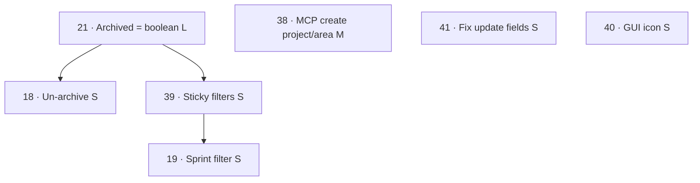

# 005 Backlog Cleanup — Pre-Planning

**Status:** Draft for review  
**Goal:** Clear the open `kwi` work item backlog (was 6 items; 7 after a bug
found during this review) in as few sprints as is reasonable.  
**Next step:** Iterate on this doc, then feed the "Suggested `/speckit.specify`
input" section into `/speckit.specify`.  

---

## 1. Item inventory (after review)

| Pri | ID | Title | Type | Area | Size | Δ |
|----:|---:|-------|------|------|:----:|---|
| 1 | 40 | Custom icon for the GUI | issue | gui | S | — |
| 2 | 38 | Add project and area creation to MCP | feature | mcp | M | — |
| 3 | 39 | Filter is not "sticky" | issue | gui | S | — |
| 4 | 19 | Filter for sprint | feature | gui | S | — |
| 5 | 18 | Un-archive an archived item | issue | gui | S | — |
| 6 | 21 | Archived should be separate from status | feature | gui | **L** | M→L |
| — | 41 | Cannot update tshirt/area/parent via CLI or MCP | bug | cli | S | new |

(Priority column reflects your stated order; #41 is newly discovered — see §2.)

**Rough total:** 1×L, 1×M, 5×S.

---

## 2. Review notes & clarifications

### WI 21 — Archived should be separate from status *(keystone, M→L)*
This is the foundational change and was under-sized. It spans:
- **Schema:** add `archived boolean NOT NULL DEFAULT false` to `workitem`,
  decoupled from `wi_status`.
- **Data migration:** existing rows with status `archived` → `status='closed',
  archived=true`. Decide whether to retire the `archived` row in
  `workitem_status` afterward (FK-safe only once no rows reference it).
- **All four layers:** `archive_workitem` in queries (currently sets
  status='archived' → must set `archived=true`), CLI `work archive`, MCP
  `archive_work_item`, and the GUI.
- **Behavior:** archiving becomes non-destructive (status preserved) and the
  archive confirmation pop-up is removed.

→ Size raised to **L** and the area set to `gui` (it's GUI-led but touches
core). Recorded in the item's details.

### WI 18 — Un-archive button *(depends on 21)*
Add an "Un-archive" action on the archived-item detail view. Trivial once 21
lands (just toggle `archived=false`). **Should be built after 21** — before
21 there's no clean "previous status" to restore to.

### WI 39 — Filter not "sticky" *(interacts with 21)*
Three distinct asks bundled here:
1. **Default to exclude closed** (currently sprint 004 defaults to all-except-
   archived). After 21, "archived" leaves the status list, so the new default
   becomes *all statuses except `closed`*.
2. **Sticky within the session** as the user navigates the UI.
3. **Cross-session persistence** (explicitly lower priority) — could reuse the
   `localStorage` path already in play for window-state.
4. **Visual cue** when a filter is not at its default.

→ Best implemented **after 21** so the filter logic is written once against the
final status model. Recommend cross-session persistence be an optional stretch.

### WI 19 — Sprint filter dropdown
Add a sprint filter, dynamically built from the distinct `sprint` values plus an
"Unassigned" bucket for null sprints. Reuse the existing `MultiSelectFilter`
component (multi-select, all-selected by default) for consistency with sprint
004. Folds naturally into the WI 39 sticky-filter work.

### WI 38 — Project & area creation in MCP
Add `create_project` and `create_area` (and likely `list`/seed default areas)
MCP tools so a new project's agent no longer has to drop to the CLI. Independent
of the schema work. Closely related to **#41** (both are MCP/CLI completeness).

### WI 40 — Custom GUI icon
Source PNG: `/gratch/kIcons/kwi-kiwi-mascot-cropped.png`.
**Clarification / scope reduction:** the Tauri CLI already ships `tauri icon`,
which generates the full platform icon set (`.png`, `.ico`, `.icns`) from one
source PNG — so **no new tool install is likely required**, and the proposed
hand-off doc to `ansible-k` may be unnecessary. Only caveat: the source should
be square (or we pad it). To confirm during planning.

### WI 41 — Cannot update tshirt/area/parent *(new, found during this review)*
While trying to bump WI 21's size, the update silently no-opped. Root cause:
`queries.update_workitem`'s `field_map` omits `wi_tshirt`/`area_id`/`parent_id`;
the CLI `work set` doesn't expose them; and the MCP `update_work_item` accepts
the params but drops them. Fix is small and additive across the same three
layers. (Planning workaround: a direct SQL `UPDATE` was used to set WI 21.)

---

## 3. Dependency analysis

- **Coupled cluster (schema/filter):** 21 → 18, 39 → 19. Must be sequenced.
- **Independent / additive:** 38, 41, 40 — can be done anytime, in parallel.

---

## 4. Sprint recommendation

**Recommendation: one sprint (`005`) clearing all 7 items**, sequenced in three
waves. The volume (1L + 1M + 5S) is comparable to sprint 004 (7 stories / 37
tasks), and a single sprint achieves your goal of emptying the backlog in one
pass. The only real risk is the WI 21 schema/data migration — which we isolate
as Wave 1 and validate before building the dependent GUI work.

> **Heads-up on your priority order:** you listed 21 *last*, but 18 and 39
> depend on it, so within the sprint 21 must be implemented *first*. Your high-
> priority independents (40, 38) aren't blocked and can run in parallel from day
> one — so they still land early.

### Proposed waves (implementation order)
- **Wave 1 — Foundation:** WI 21 (schema + migration + all-layer archive
  rework + remove confirmation). Validate migration on a copy before merge.
- **Wave 2 — Built on the new model:** WI 18 (un-archive), WI 39 (sticky
  filters + new defaults + visual cue), WI 19 (sprint filter).
- **Wave 3 — Independent/additive (parallel, any time):** WI 38 (MCP
  project/area), WI 41 (fix update fields), WI 40 (GUI icon).

### Fallback — two sprints (if scope feels heavy during planning)
- **005A — Archived & filters:** 21, 18, 39, 19 (the coupled GUI/core cluster).
- **005B — MCP & tooling polish:** 38, 41, 40 (additive, no schema impact).

---

## 5. Proposed user-story priorities for the spec

Mapping your intent onto P-levels while honoring dependencies:

| Story | Item | P | Rationale |
|-------|------|---|-----------|
| Archived as a first-class flag | 21 | **P1** | Foundational; unblocks 18/39 |
| MCP project & area creation | 38 | **P1** | Your #2; independent, high value |
| Custom GUI icon | 40 | **P1** | Your #1; independent, quick |
| Sticky filters & sensible defaults | 39 | **P2** | Needs 21 |
| Sprint filter dropdown | 19 | **P2** | Needs 39's filter work |
| Un-archive action | 18 | **P2** | Needs 21 |
| Fix tshirt/area/parent updates | 41 | **P3** | Small correctness fix |

---

## 6. Open questions for you

1. **One sprint or the two-sprint fallback?** (Recommendation: one sprint.)
    - agree; one sprint
2. **WI 21:** after migrating rows, do we *remove* the `archived` value from
   `workitem_status`, or leave it orphaned-but-harmless?
    - yes, delete the archived lookup row post-migration
3. **WI 39 cross-session persistence:** in-scope for this sprint, or stretch?
    - thinking deeper here, if we make the default to not show `closed`, I don't think we need persistence. Let's keep this out of scope. I'll resurface this later if I decide it needs it.
4. **WI 40:** OK to confirm `tauri icon` covers it (no `ansible-k` hand-off)?
   Is the source PNG square, or should we pad it?
    - source PNG is square (760x760), confirmed with `identify -format "%wx%h\n" /gratch/kIcons/kwi-kiwi-mascot-cropped.png`
5. **Include WI 41** in this sprint, or track it separately?
    - include; good catch on a pretty big miss!

---

## 7. Suggested `/speckit.specify` input (single-sprint option)

> Clear the kwi backlog in one sprint (005). Make **archived** a first-class
> boolean on work items, separate from status: add an `archived` column, migrate
> existing archived rows to `status=closed, archived=true`, then remove the
> now-unused `archived` row from the `workitem_status` lookup table, rework
> archive/un-archive across the DB, CLI, MCP, and GUI, and remove the archive
> confirmation dialog. Add an **un-archive** action in the GUI. Make the GUI
> work-item **filters sticky** within a session (no cross-session persistence),
> default the status filter to exclude `closed`, and show a visual cue when a
> filter is off its default. Add a **sprint filter** dropdown (dynamic list +
> "Unassigned") using the existing multi-select component. Add **MCP tools to
> create projects and areas**. Fix the **update path so tshirt, area, and parent
> can be set** via both the CLI `work set` command and the MCP
> `update_work_item` tool. Replace the default Svelte **GUI icon** with the kiwi
> mascot using the Tauri icon generator.
